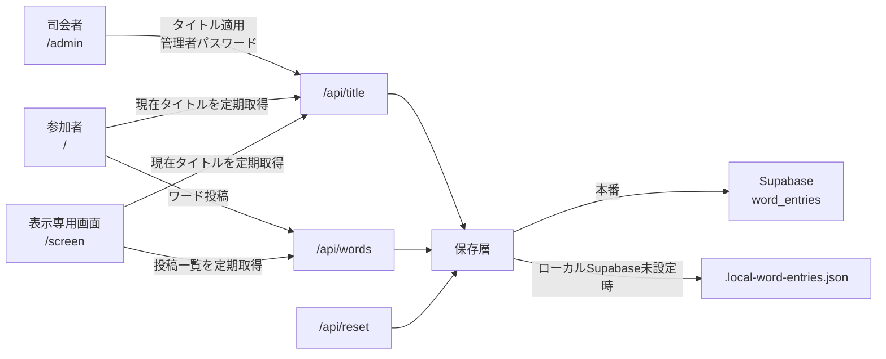
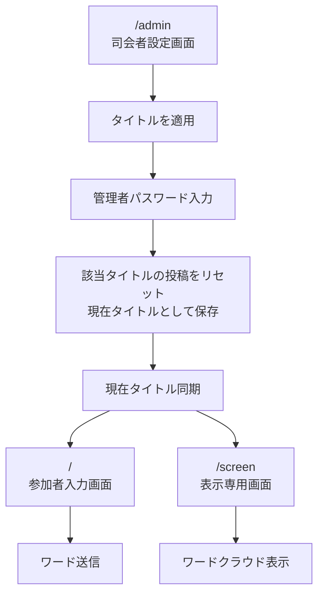
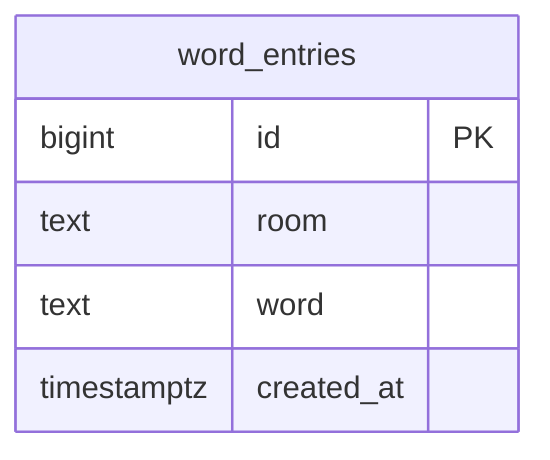
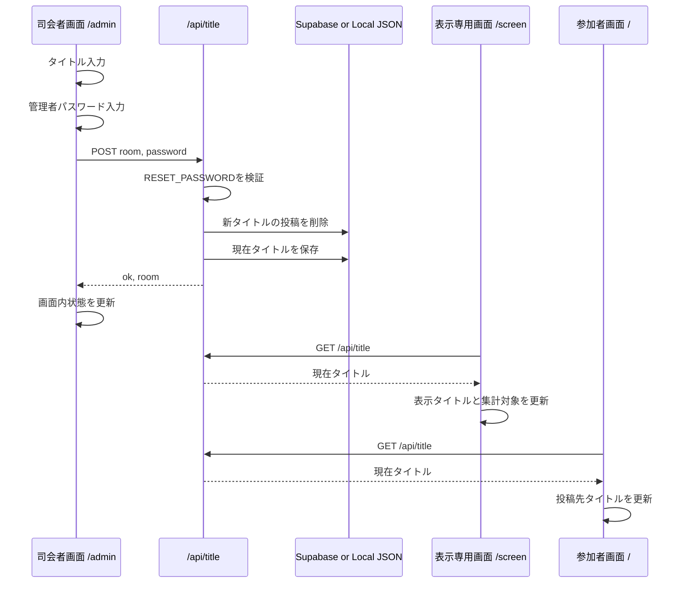
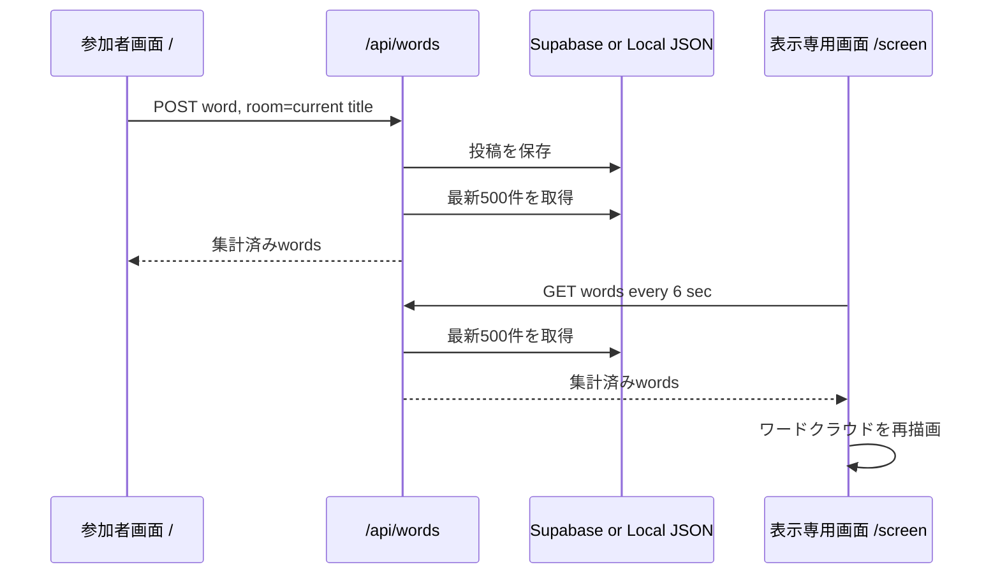
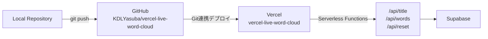

# Vercel Live Word Cloud システム構成図

## 全体構成



## 画面構成



## API構成

| API | Method | 役割 |
| --- | --- | --- |
| `/api/title` | `GET` | 現在のタイトルを取得 |
| `/api/title` | `POST` | 管理者パスワードを検証し、タイトルを適用。同時にそのタイトルの投稿をリセット |
| `/api/words?room=...` | `GET` | 指定タイトルの投稿を集計して取得 |
| `/api/words?room=...` | `POST` | 指定タイトルへワードを投稿 |
| `/api/reset?room=...` | `POST` | 指定タイトルの投稿をリセット |

## データ保存

本番環境ではSupabaseの `word_entries` テーブルを使います。



通常投稿は以下のように保存されます。

| room | word |
| --- | --- |
| `今日の学び` | `発見` |
| `今日の学び` | `安心` |

現在タイトルは、追加テーブルを作らず、同じ `word_entries` の特殊roomに保存します。

| room | word |
| --- | --- |
| `__live_word_cloud_state__` | `今日の学び` |

ローカルでSupabase環境変数がない場合は、同じ形式のデータを `.local-word-entries.json` に保存します。

## タイトル適用フロー



## ワード投稿フロー



## 環境変数

| 変数名 | 用途 |
| --- | --- |
| `SUPABASE_URL` | Supabase Project URL |
| `SUPABASE_SERVICE_ROLE_KEY` | Supabase REST APIへアクセスするサーバー用キー |
| `SUPABASE_SECRET_KEY` | `SUPABASE_SERVICE_ROLE_KEY` の代替 |
| `SUPABASE_TABLE` | 保存テーブル名。未設定時は `word_entries` |
| `RESET_PASSWORD` | タイトル適用・リセット用の管理者パスワード |

## デプロイ構成



## ローカル実行

```bash
cd /Users/yasuba/Library/CloudStorage/Dropbox/workspace/AI/Codex/vercel-live-word-cloud
npm run local
```

ローカルURL:

| 画面 | URL |
| --- | --- |
| 司会者設定 | `http://localhost:4000/admin` |
| 参加者入力 | `http://localhost:4000/` |
| 表示専用 | `http://localhost:4000/screen` |

ローカルでSupabase環境変数が未設定の場合、管理者パスワードは以下です。

```text
local-reset
```

